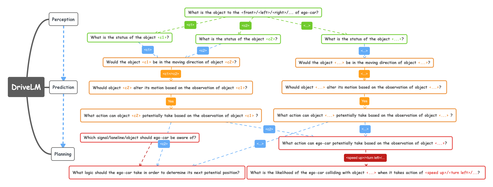
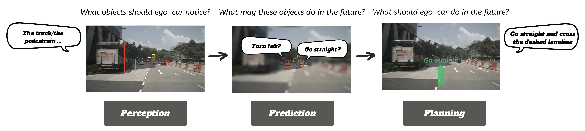
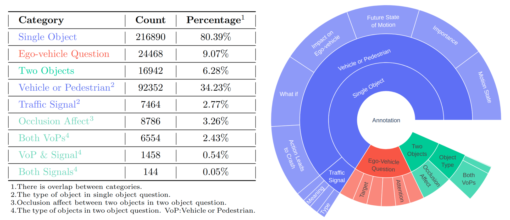

  

    

**Drive on Language:** *Unlocking the future where autonomous driving meets limitless language potential.*

 

https://github.com/OpenDriveLab/DriveLM/assets/103363891/72f49215-9894-440f-a2d0-3ba1cfc3b792

## 🔥Highlights of DriveLM Dataset

#### In the view of general Vision Language Model
- Structured-reasoning, multi-modality **Tree-of-Thought** testbench.

  

  

    
  

  

 
#### In the view of full-stack autonomous driving
- Completeness in functionality (covering **Perception**, **Prediction** and **Planning** QA pairs)

  

    
  

- Reasoning for future events that does not even happened
  - Many **"What If"**-style questions, imagine the future by language
 

  

    
  

- Task-driven Decomposition.
  - **One** scene-level text-goal into **Many** frame-level trajectory & planning-text

## Table of Contents
- [News](#news)
- [Introduction](#introduction)
- [Getting Start](#getting-start)
- [License and Citation](#license-and-citation)
- [Other Projects in OpenDriveLab](#Other-Projects-in-OpenDriveLab)

## News

- **`[2023/08/25]`** DriveLM dataset demo `v1.0` released

(<a href="#top">back to top</a>)

## Introduction

DriveLM is a project of driving on language, which contains both `Dataset` and `Model`. Through DriveLM, we introduce the reasoning ability of large language model in autonomous driving (AD) to make decision and ensure explainable planning.

Specifically, in the `Dataset` of DriveLM, we facilitates `Perception, Prediction and Planning (P3)` with human-written reasoning logic as connection. And in the `Model` part, we propose an AD visual-language model with tree-of-thought ability to produce better planning result. Currently, the dataset is released as demo and the model will be released in the future.

### What's included in DriveLM dataset?
We construct our dataset based on the prevailing nuScenes. The most central element of DriveLM is frame-based Q&A. Basically, we divide our Q&A pairs into three part: `Perception`, `Prediction` and `Planning`. `Perception` questions require the model to recognize objects in the scene. `Prediction` questions ask the model to predict the future status of important objects in the scene. `Planning` questions prompt the model to give reasonable planning actions and avoid dangerous ones.

### What's the annotation process?

1️⃣ Key frames selection. Given all frames in one clip, the annotator selects which are the key frames that need to annotate. The criteria is that those frames should involve changing of movement status (lane changing, sudden stop, start from stop).

2️⃣ Key objects selection. Given key frames, the annotator needs to pick up key objects in the six surrounding images. The criteria is that those objects should be possible to affect the action of ego-vehicle (traffic signals, pedestrian crossing the road, other vehicles that run into the direction of ego-vehicle).

3️⃣ Question and Answer annotation. Given those key objects, we automatically generate questions on single object and multi objects about perception, prediction and planning. More detail can be found in our demo data.

### :fire:  The *first* language-driving dataset facilitating P3 and logic

  
|  Dataset  | Base Dataset |      Language Form    |   Perspectives | Scale      |  Release?|
|:---------:|:-------------:|:--------------------:|:------:|:--------------------------------------------:|:----------:|
| [BDD-X 2018](https://github.com/JinkyuKimUCB/explainable-deep-driving)  |  BDD  | Description | Planning description & Justification    | 8M frame,20k text   |**:heavy_check_mark:**|
| [Talk2Car 2019](https://github.com/talk2car/Talk2Car)   |      nuScenes    | Description |  Goal point Description | 30k frame,10k text | **:heavy_check_mark:**|
| [nuScenes-QA 2023](https://arxiv.org/abs/2305.14836)   |   nuScenes  | VQA |  Perception result     | 30k frame, 460k text| :x:|
| **DriveLM 2023** | nuScenes| **:boom: VQA+Description** | **:boom:Perception, Prediction and Planning with Logic** | 30k frame, 600k text|**:heavy_check_mark:** Mid August|

  

(<a href="#top">back to top</a>)

## Getting Start
- [Download Data](/docs/getting_started.md#download-data)
- [Prepare Dataset](/docs/getting_started.md#prepare-dataset)
- [Evaluation]() **(TBA in the future)**.

(<a href="#top">back to top</a>)

## License and Citation
All assets and code in this repository are under the [Apache 2.0 license](./LICENSE) unless specified otherwise. The data is under [CC BY-NC-SA 4.0](https://creativecommons.org/licenses/by-nc-sa/4.0/). Please consider citing our project if the dataset helps your research.

(<a href="#top">back to top</a>)

## Other Projects in OpenDriveLab

- [DriveAGI](https://github.com/OpenDriveLab/DriveAGI) | [UniAD](https://github.com/OpenDriveLab/UniAD) | [OpenLane-V2](https://github.com/OpenDriveLab/OpenLane-V2)
- [Survey on Bird's-eye-view Perception](https://github.com/OpenDriveLab/BEVPerception-Survey-Recipe) | [BEVFormer](https://github.com/fundamentalvision/BEVFormer) | [OccNet](https://github.com/OpenDriveLab/OccNet)

(<a href="#top">back to top</a>)

