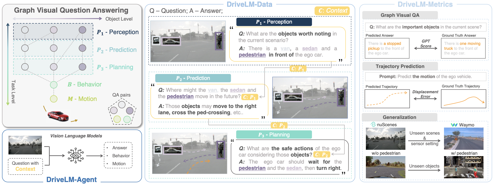
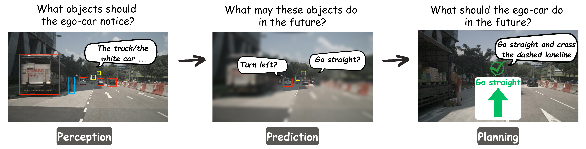
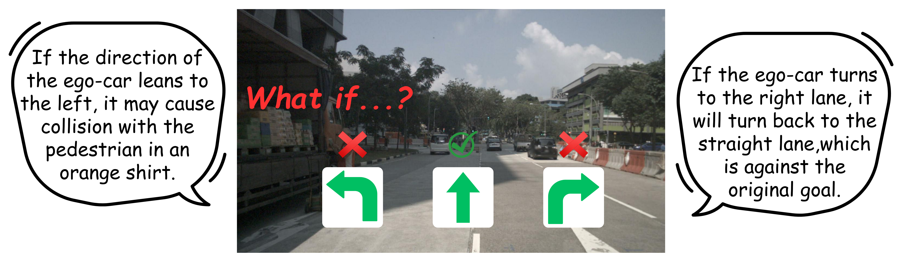
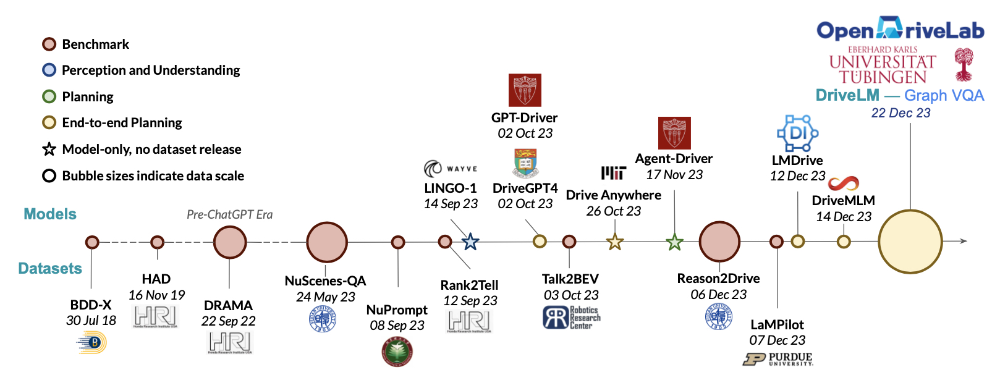
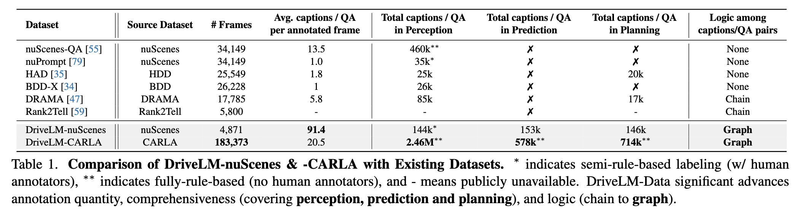
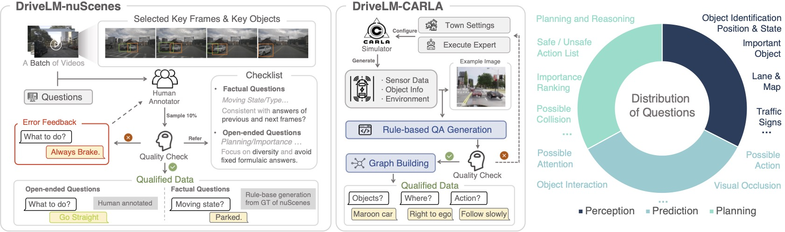

<div id="top" align="center">

<p align="center">
  
</p>
    
**DriveLM:** *Driving with **G**raph **V**isual **Q**uestion **A**nswering*

<!-- Download dataset [**HERE**](docs/data_prep_nus.md) (serves as Official source for `Autonomous Driving Challenge 2024`) -->
`Autonomous Driving Challenge 2024` **Driving-with-Language track** is [activated](https://github.com/OpenDriveLab/DriveLM/tree/main/challenge)!
</div>

<div id="top" align="center">

[](https://opendrivelab.com/DriveLM/)
[](#licenseandcitation)
[](https://arxiv.org/abs/2312.14150)
[](#gettingstarted)
[](https://huggingface.co/spaces/AGC2024/driving-with-language-2024)

<!-- <a href="https://opendrivelab.github.io/DriveLM" target="_blank">
    
  </a> -->

<!-- [](https://huggingface.co/datasets/OpenDrive/DriveLM) -->

</div>


<!-- > https://github.com/OpenDriveLab/DriveLM/assets/103363891/67495435-4a32-4614-8d83-71b5c8b66443 -->

<!-- > above is old demo video. demo scene token: cc8c0bf57f984915a77078b10eb33198 -->

https://github.com/OpenDriveLab/DriveLM/assets/54334254/cddea8d6-9f6e-4e7e-b926-5afb59f8dce2

<!-- > above is new demo video. demo scene token: cc8c0bf57f984915a77078b10eb33198 -->

## Highlights <a name="highlight"></a>

🔥 We instantiate datasets (**DriveLM-Data**) built upon nuScenes and CARLA, and propose a VLM-based baseline approach (**DriveLM-Agent**) for jointly performing **Graph VQA** and end-to-end driving. 

<!-- 🔥 **The key insight** is that with our proposed suite, we obtain a suitable proxy task to mimic the human reasoning process during driving.  -->

🏁 **DriveLM** serves as a main track in the [**`CVPR 2024 Autonomous Driving Challenge`**](https://opendrivelab.com/challenge2024/#driving_with_language). Everything you need for the challenge is [HERE](https://github.com/OpenDriveLab/DriveLM/tree/main/challenge), including baseline, test data and submission format and evaluation pipeline!

<p align="center">
  
</p>


<!-- ### Highlights of the DriveLM-Data -->

<!-- #### In the view of full-stack autonomous driving
- 🛣 Completeness in functionality (covering **Perception**, **Prediction**, and **Planning** QA pairs).


<p align="center">
  
</p>  -->


<!-- - 🔜 Reasoning for future events that have not yet happened.
  - Many **"What If"**-style questions: imagine the future by language.
 

<p align="center">
  
</p>

- ♻ Task-driven decomposition.
  - **One** scene-level description into **many** frame-level trajectories & planning QA pairs.

<p align="center">
  
</p> -->

<!-- ### Highlights of the DriveLM-Agent -->

<!-- #### In the view of the general Vision Language Models -->
<!-- 🕸️ Multi-modal **Graph Visual Question Answering** (GVQA) benchmark for structured reasoning in the general Vision Language Models.

https://github.com/OpenDriveLab/DriveLM-new/assets/75412366/78c32442-73c8-4f1d-ab69-34c15e7060af -->

<!-- > above is graph VQA demo video.  -->

## Table of Contents
1. [Highlights](#highlight)
2. [Getting Started](#gettingstarted)
   - [Prepare DriveLM-nuScenes](docs/data_prep_nus.md)  
3. [Current Endeavors and Future Horizons](#timeline)
4. [News and TODO List](#newsandtodolist)
   - [News](#news)
   - [TODO List](#todolist)
5. [DriveLM-Data](#drivelmdata)
   - [Comparison and Stats](#comparison)
   - [GVQA Details](docs/gvqa.md)
   - [Annotation and Features](docs/data_details.md)
6. [License and Citation](#licenseandcitation)
7. [Other Resources](#otherresources)

<!--
- [News](#news)
- [DriveLM-Data](#drivelm-data)
- [Getting Started](#getting-started)
- [License and Citation](#license-and-citation)
- [Other Resources](#other-resources) -->


## Getting Started <a name="gettingstarted"></a>
To get started with DriveLM: 
- [Prepare DriveLM-nuScenes](/docs/data_prep_nus.md)
- [Challenge devkit](/challenge/)
- [More content coming soon](#todolist)

<p align="right">(<a href="#top">back to top</a>)</p>


## Current Endeavors and Future Directions  <a name="timeline"></a>
> - The advent of GPT-style multimodal models in real-world applications motivates the study of the role of language in driving.
> - Date below reflects the arXiv submission date.
> - If there is any missing work, please reach out to us!

<p align="center">
  
</p>

DriveLM attempts to address some of the challenges faced by the community.

- **Lack of data**: DriveLM-Data serves as a comprehensive benchmark for driving with language.
- **Embodiment**: GVQA provides a potential direction for embodied applications of LLMs / VLMs.
- **Closed-loop**: DriveLM-CARLA attempts to explore closed-loop planning with language.

<p align="right">(<a href="#top">back to top</a>)</p>

## News and TODO List <a name="newsandtodolist"></a>

### News <a name="news"></a>

- **`[2024/03/25]`** Challenge test server is online and the test questions are released. [Chekc it out!](https://github.com/OpenDriveLab/DriveLM/tree/main/challenge)
- **`[2024/02/29]`** Challenge repo release. Baseline, data and submission format, evaluation pipeline. [Have a look!](https://github.com/OpenDriveLab/DriveLM/tree/main/challenge)
- **`[2023/08/25]`** DriveLM-nuScenes demo released.
- **`[2023/12/22]`** DriveLM-nuScenes full `v1.0` and [paper](https://arxiv.org/abs/2312.14150) released.
- **`[Early 2024]`** DriveLM-Agent inference code.
- **`Note:`** We plan to release a simple, flexible training code that supports multi-view inputs as a starter kit for the AD challenge (stay tuned for details).

### TODO List <a name="todolist"></a>

- [ ] DriveLM-Data
  - [x] DriveLM-nuScenes
  - [ ] DriveLM-CARLA
- [x] DriveLM-Metrics
  - [x] GPT-score
- [ ] DriveLM-Agent
  - [x] Inference code on DriveLM-nuScenes
  - [ ] Inference code on DriveLM-CARLA

<p align="right">(<a href="#top">back to top</a>)</p>

## DriveLM-Data <a name="drivelmdata"></a>

We facilitate the `Perception, Prediction, Planning, Behavior, Motion` tasks with human-written reasoning logic as a connection between them. We propose the task of [GVQA](docs/gvqa.md) on the DriveLM-Data. 

<!-- DriveLM is an autonomous driving (**AD**) dataset incorporating linguistic information. Through DriveLM, we want to connect large language models and autonomous driving systems, and eventually introduce the reasoning ability of Large Language Models in autonomous driving (**AD**) to make decisions and ensure explainable planning. -->

<!-- In DriveLM, we study how vision-language models (VLMs) trained on web-scale data can be integrated into end-to-end driving systems to boost generalization and enable interactivity with human users.

Specifically, we aim to facilitate `Perception, Prediction, Planning, Behavior, Motion` tasks with human-written reasoning logic as a connection. We propose the task of GVQA to connect the QA pairs in a graph-style structure. To support this novel task, we provide the DriveLM-Data.


### What is GVQA?
The most exciting aspect of the dataset is that the questions and answers (`QA`) are connected in a graph-style structure, with QA pairs as every node and potential logical progression as the edges. The reason for doing this in the AD domain is that AD tasks are well-defined per stage, from raw sensor input to final control action through perception, prediction and planning.

Its key difference to prior VQA tasks for AD is the availability of logical dependencies between QAs, which can be used to guide the answering process. -->

### 📊 Comparison and Stats <a name="comparison"></a>
**DriveLM-Data** is the *first* language-driving dataset facilitating the full stack of driving tasks with graph-structured logical dependencies.
<!-- <center>
  
| Language Dataset  | Base Dataset |      Language Form    |   Perspectives | Scale      |  Release?|
|:---------:|:-------------:|:-------------:|:------:|:--------------------------------------------:|:----------:|
| [BDD-X 2018](https://github.com/JinkyuKimUCB/explainable-deep-driving)  |  [BDD](https://bdd-data.berkeley.edu/)  | Description | Perception & Reasoning    | 8M frames, 20k text strings   |**:heavy_check_mark:**|
| [HAD 2019](https://usa.honda-ri.com/had)  |  [HDD](https://usa.honda-ri.com/hdd)  | Advice | Goal-oriented & stimulus-driven advice | 5,675 video clips, 45k text strings   |**:heavy_check_mark:**|
| [DRAMA 2022](https://usa.honda-ri.com/drama)   |    - | Description | Perception & Planning results | 18k frames, 100k text strings | **:heavy_check_mark:**|
| [Rank2Tell 2023](https://arxiv.org/abs/2309.06597)   |   - | Perception & Planning results |  QA + Captions | 5k frames | :x: |
| [nuScenes-QA 2023](https://arxiv.org/abs/2305.14836)   |   [nuScenes](https://www.nuscenes.org/)  | QA |  Perception Result     | 30k frames, 460k generated QA pairs|**:heavy_check_mark:**|
| [nuPrompt 2023](https://arxiv.org/abs/2309.04379)   |   [nuScenes](https://www.nuscenes.org/)  | Object Description |  Perception Result     | 30k frames, 35k semi-generated QA pairs| :x:|
| **DriveLM 2023** | [nuScenes](https://www.nuscenes.org/) | **:boom: QA + Scene Description** | **:boom:Perception, Prediction and Planning with Logic** | 30k frames, 360k annotated QA pairs |**:heavy_check_mark:** |

</center> -->

<p align="center">
  
</p>

Links to details about [GVQA task](docs/gvqa.md), [Dataset Features](docs/data_details.md/#features), and [Annotation](docs/data_details.md/#annotation).

<!-- More details can be found [HERE](docs/data_details.md). -->
<!--
### What is included in the DriveLM-Data?
DriveLM-Data comprises two distinct components: DriveLM-nuScenes and DriveLM-CARLA. In the case of DriveLM-nuScenes, we construct our dataset based on the prevailing nuScenes dataset. As for DriveLM-CARLA, we collect data from the CARLA simulator. The most central element of DriveLM is frame-based `multi-stage` `QA`. `Perception` questions require the model to recognize objects in the scene. `Prediction` questions ask the model to predict the future status of important objects in the scene. `Planning` questions prompt the model to give reasonable planning actions and avoid dangerous ones. We also include a `Behavior` question that provides behavior templates which aggregate the information from the other question types.


### How about the annotation process?

<p align="center">
  
</p>

**For DriveLM-nuScenes:**

1️⃣ Keyframe selection. Given all frames in one clip, the annotator selects the keyframes that need annotation. The criterion is that those frames should involve changes in ego-vehicle movement status (lane changes, sudden stops, start after a stop, etc.).

2️⃣ Key objects selection. Given keyframes, the annotator needs to pick up key objects in the six surrounding images. The criterion is that those objects should be able to affect the action of the ego vehicle (traffic signals, pedestrians crossing the road, other vehicles that move in the direction of the ego vehicle, etc.).

3️⃣ Question and answer annotation. Given those key objects, we automatically generate questions regarding single or multiple objects about perception, prediction, and planning. More details can be found in our data.

**For DriveLM-CARLA:**

We collect data using CARLA 0.9.14 in the Leaderboard 2.0 framework with a privileged rule-based expert. We set up a series of routes in urban, residential, and rural areas and execute the expert on these routes. During this process, we collect the necessary sensor data, generate relevant QAs based on privileged information about objects and the scene, and organize the logical relationships to connect this series of QAs into a graph.

-->

<p align="right">(<a href="#top">back to top</a>)</p>


## License and Citation <a name="licenseandcitation"></a>
All assets and code in this repository are under the [Apache 2.0 license](./LICENSE) unless specified otherwise. The language data is under [CC BY-NC-SA 4.0](https://creativecommons.org/licenses/by-nc-sa/4.0/). Other datasets (including nuScenes) inherit their own distribution licenses. Please consider citing our paper and project if they help your research.

```BibTeX
@article{sima2023drivelm,
  title={DriveLM: Driving with Graph Visual Question Answering},
  author={Sima, Chonghao and Renz, Katrin and Chitta, Kashyap and Chen, Li and Zhang, Hanxue and Xie, Chengen and Luo, Ping and Geiger, Andreas and Li, Hongyang},
  journal={arXiv preprint arXiv:2312.14150},
  year={2023}
}
```

```BibTeX
@misc{contributors2023drivelmrepo,
  title={DriveLM: Driving with Graph Visual Question Answering},
  author={DriveLM contributors},
  howpublished={\url{https://github.com/OpenDriveLab/DriveLM}},
  year={2023}
}
```

<p align="right">(<a href="#top">back to top</a>)</p>

## Other Resources <a name="otherresources"></a>
<a href="https://twitter.com/OpenDriveLab" target="_blank">
    
  </a>

<!-- <a href="https://opendrivelab.com" target="_blank">
  
</a> -->

<!--
 [](https://badges.toozhao.com/stats/01H9CR01K73G1S0AKDMF1ABC73 "Get your own page views count badge on badges.toozhao.com")
-->

**OpenDriveLab**
- [DriveAGI](https://github.com/OpenDriveLab/DriveAGI) | [UniAD](https://github.com/OpenDriveLab/UniAD) | [OpenLane-V2](https://github.com/OpenDriveLab/OpenLane-V2) | [Survey on E2EAD](https://github.com/OpenDriveLab/End-to-end-Autonomous-Driving)
- [Survey on BEV Perception](https://github.com/OpenDriveLab/BEVPerception-Survey-Recipe) | [BEVFormer](https://github.com/fundamentalvision/BEVFormer) | [OccNet](https://github.com/OpenDriveLab/OccNet)

<a href="https://twitter.com/AutoVisionGroup" target="_blank">
    
  </a>

**Autonomous Vision Group**
- [tuPlan garage](https://github.com/autonomousvision/tuplan_garage) | [CARLA garage](https://github.com/autonomousvision/carla_garage) | [Survey on E2EAD](https://github.com/OpenDriveLab/End-to-end-Autonomous-Driving)
- [PlanT](https://github.com/autonomousvision/plant) | [KING](https://github.com/autonomousvision/king) | [TransFuser](https://github.com/autonomousvision/transfuser) | [NEAT](https://github.com/autonomousvision/neat)

<p align="right">(<a href="#top">back to top</a>)</p>
