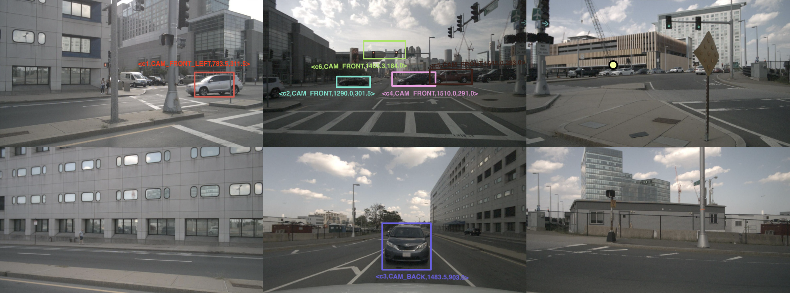

## Download data
To get started, download nuScenes V1.0 full dataset data and CAN bus expansion data [HERE](https://www.nuscenes.org/download).

Next, you should download the dataset of DriveLM. Note that to download the DriveLM dataset, you need fill out a google form (shown below) and we will send you the download link afterwards.


- `DriveLM version-1.0 demo` [Download Link](https://docs.google.com/forms/d/e/1FAIpQLSeX6CR3u-15IV-TKx2uPv1wiKjydjZ__NNW98H4nR5JZtQa2Q/viewform).

Our demo dataset contains a collection of questions and answers. The dataset is provided in two versions:

- `v1_0_train_demo.json`: In this file, questions and answers are not augmented using GPT-3.5/4.0. The answers tend to follow relatively fixed patterns, resulting in straightforward and less diverse responses.

- `gpt_augmented_v1_0_train_demo.json`: Unlike the previous file, questions and answers in this version have been augmented using GPT. This optimization enhances the diversity of Q&A pairs. Consequently, responses are not limited to simple and direct Q&A, but may include richer expressions and content.
## Prepare dataset

Follow the steps [HERE](https://github.com/fundamentalvision/BEVFormer/blob/master/docs/prepare_dataset.md) to prepare nuScenes dataset. Using the above code will generate `nuscenes_infos_temporal_{train,val}.pkl`.

#### Folder structure.
```
DriveLM
├── data/
│   ├── QA_dataset/
│   │   ├── train.json
│   │   ├── val.json
│   ├── nuscenes/
│   │   ├── maps/
│   │   ├── samples/
│   │   ├── sweeps/
│   │   ├── v1.0-test/
|   |   ├── v1.0-trainval/
|   |   ├── nuscenes_infos_temporal_train.pkl
|   |   ├── nuscenes_infos_temporal_val.pkl
```


#### File structure

The QA pairs are in the `{train,val}.json`. Below is the json file structure.
```
train.json
├── scene_token:{
│   ├── scene_description:
│   ├── key_frame:{
│   │   ├── CAM_FRONT_timestamp_1:{
│   │   │   ├── Perception:{
│   │   │   │   ├──q:["Q: XXX", ...]
│   │   │   │   ├──a:["A: XXX", ...]
│   │   │   │   ├──description:{
│   │   │   │   │   ├── {"<c1,CAM_BACK_RIGHT,2014.0,953.0>": "<c1,CAM_BACK_RIGHT,2014.0,953.0> is a moving car to the back right of the ego car.", ...}
│   │   │   │   ├──}
│   │   │   ├──}
│   │   │   ├── Prediction and Planning:{
│   │   │   │   ├──q:["Q: Is <c1,CAM_BACK_RIGHT,2014.0,953.0> a traffic sign or a road barrier?", ...]
│   │   │   │   ├──a:["A: Neither.", ...]
│   │   │   ├──}
│   │   ├── CAM_FRONT_timestamp_2:{
│   │   │   ├── Perception:{
│   │   │   │   ├──q:[]
│   │   │   │   ├──a:[]
│   │   │   │   ├──description:{
│   │   │   │   │   ├── {"<c1,CAM_FRONT,1362.2,782.9>": "<c1,CAM_FRONT,1362.2,782.9> is a moving car to the front of the ego car.", ...}
│   │   │   │   ├──}
│   │   │   ├──}
│   │   │   ├── Prediction and Planning:{
│   │   │   │   ├──q:[]
│   │   │   │   ├──a:[]
│   │   │   ├──}
│   │   ├── ... }
│   │   ├──}
│   ├──}
├──}
```

- `scene_token` is the same as in nuScenes dataset.
- Under `key_frame`, each key frame are identified by the CAM_FRONT timestampt, which is the same as the CAM_FRONT timestamp in nuScenes dataset.
- `scene_description` is a one-sentence summary of ego-vehicle behavior in the 20-seconds video clip (the notion of scene in nuScenes dataset).
- `q` and `a` are python list, with each element a string of either `question` or `answer`.
- The `description` under `Perception` is a mapping between `c tag` (i.e. \<c1,CAM_FRONT,1362.2,782.9\>) and its textual description of visual appearance.

**Note:** The `c tag` label is used to indicate key objects selected during the annotation process that are meaningful for self-driving of the ego vehicle. These objects include not only those present in the ground truth but also objects that are not present in the ground truth, such as landmarks and traffic lights. Each key frame contains a minimum of three and a maximum of six key objects. The organization format of the `c tag` is `<cx,CAM_XXX,x,y>`, representing the index, the corresponding camera (CAM_XXX), the x-coordinate, and the y-coordinate. The x and y coordinates refer to the positions on the stitched image obtained by combining the outputs of six cameras. The resulting stitched image has size of 2880*1040.

<p align="center">
  
</p>


## Evaluation

To be announced in the future!
