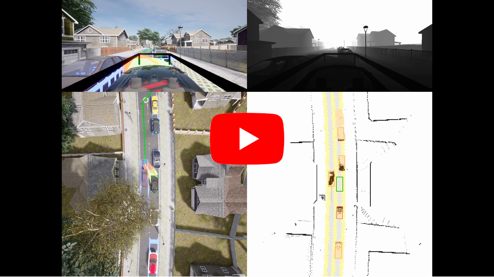

<h1 align="center">
PDM-Lite: A Rule-Based Planner for CARLA Leaderboard 2.0
</h1>

[](https://www.youtube.com/watch?v=uic3xwcOQ9w "PDM-Lite")

PDM-Lite is a rule-based privileged expert system achieving state-of-the-art performance on the CARLA Leaderboard 2.0. Leveraging components like the Intelligent Driver Model and the Kinematic bicycle model, PDM-Lite navigates all 38 scenarios. This open-source system sets a robust baseline, showcasing interpretable performance and enabling efficient data collection for imitation learning. See below for its performance across various CARLA Leaderboard 2.0 datasets:

Dataset | #Seeds | RC (%) | IS | DS |
| --- | :---: | :---: | :---: | :---: |
| DevTest | 10	| 100.0 |	0.41 / 0.59 |	40.8 / 58.5 |
| Validation \\{routes 3,13} |	3 | 95.5 | 0.51 |49.3 |
| Validation | 3 | 85.9 | 0.46 | 44.3 |
| Training | 1 | 98.8 | 0.49 | 48.5 |
| Bench2Drive | 3 | 99.8 | 89.3 | 89.2 |

Find more details in the accompanying [report.pdf](docs/report.pdf) and ["Tackling CARLA Leaderboard 2.0 with
End-to-End Imitation Learning"](https://kashyap7x.github.io/assets/pdf/students/Zimmerlin2024.pdf).

## Contents

1. [Setup](#setup)
2. [Evaluation](#evaluation)
3. [Dataset](#dataset)
4. [Data Generation](#data-generation)
5. [Acknowledgements](#acknowledgements)
6. [License](#license)
7. [Contributing](#contributing)

## Setup

Clone the repository, set up CARLA Leaderboard 2.0, and create the conda environment:

```Shell
git clone git@github.com:OpenDriveLab/DriveLM.git
cd PDM-Lite
chmod +x setup_pdm_lite.sh
./setup_pdm_lite.sh
conda env create -f environment_pdm_lite.yml
conda activate pdm_lite
```
Before running the code, you need to add the following paths to your system's `PYTHONPATH` environment variable:

```Shell
export CARLA_ROOT=/path/to/CARLA/root
export WORK_DIR=/path/to/pdm_lite
export PYTHONPATH=$PYTHONPATH:${CARLA_ROOT}/PythonAPI
export PYTHONPATH=$PYTHONPATH:${CARLA_ROOT}/PythonAPI/carla
export SCENARIO_RUNNER_ROOT=${WORK_DIR}/scenario_runner
export LEADERBOARD_ROOT=${WORK_DIR}/leaderboard
export PYTHONPATH="${CARLA_ROOT}/PythonAPI/carla/":"${SCENARIO_RUNNER_ROOT}":"${LEADERBOARD_ROOT}":${PYTHONPATH}
```
You can add these lines to your shell initialization scripts (e.g., `.bashrc` or `.zshrc`) to set the environment variables permanently.

## Evaluation

To evaluate PDM-Lite on your local machine, you only need to start a single script:
```Shell
cd $WORK_DIR
bash start_expert_local.sh
```

This will start the evaluation of PDM-Lite on the official devtest routes from the CARLA Leaderboard 2.0 simulator. It will run `leaderboard_evaluator_local.py` as the main Python file, which is a modified version of the original `leaderboard_evaluator.py` with additional modifications mentioned in the paper and logging functionality.

To change the route being evaluated, modify the `PTH_ROUTE` environment variable in the [start_expert_local](start_expert_local.sh) script.
To change the location where the result file is stored, modify the `PTH_LOG` environment variable in the [start_expert_local](start_expert_local.sh) script.
To debug the agent and display the actual agent forecasts, change `DEBUG_CHALLENGE` to `1`.

## Dataset

We also provide a collection of routes on the old towns [old_towns](data/old_towns) and town 12 [50x38_town_12](data/50x38_town_12) to gather a dataset for training and a collection of routes to evaluate the agent on town 13 [50x36_town_13](data/50x36_town_13). The original routes can be found in in the [leaderboard](leaderboard/data) module.

## Data Generation

To generate a dataset of routes and scenarios from the CARLA Leaderboard 2.0 simulator on your local machine, change the `DATAGEN` environment variable in [start_expert_local](start_expert_local.sh) to `1` and execute the following commands:

```Shell
cd $WORK_DIR
./start_expert_local.sh
```

Note that generating a dataset with a single computer can be slow. For faster data generation, you should use multiple GPUs. We provide a Python script for SLURM clusters in [start_expert_slurm](start_expert_slurm.py), which works similarly to the evaluation script. Depending on the users permissions on the slurm cluster, 
one might use the more advanced script [start_expert_slurm_dynports](start_expert_slurm_dynports.py), which constantly checks jobs for failure and resubmits them in case. It also uses dynamic port allocation.

## Acknowledgements

Open-source code like this is built on the shoulders of other open-source repositories.
In particular, we would like to thank the following repository for its contributions:
* [Transfuser++](https://github.com/autonomousvision/carla_garage)

We also thank the creators of the numerous pip libraries we use. Complex projects like this would not be feasible without your contribution.

## License and Citation <a name="licenseandcitation"></a>
All assets and code in this repository are under the [Apache 2.0 license](./LICENSE) unless specified otherwise. The language data is under [CC BY-NC-SA 4.0](https://creativecommons.org/licenses/by-nc-sa/4.0/). Other datasets (including nuScenes) inherit their own distribution licenses. Please consider citing our paper and project if they help your research.

```BibTeX
@article{sima2023drivelm,
  title={DriveLM: Driving with Graph Visual Question Answering},
  author={Sima, Chonghao and Renz, Katrin and Chitta, Kashyap and Chen, Li and Zhang, Hanxue and Xie, Chengen and Luo, Ping and Geiger, Andreas and Li, Hongyang},
  journal={arXiv preprint arXiv:2312.14150},
  year={2023}
}
```

```BibTeX
@misc{contributors2023drivelmrepo,
  title={DriveLM: Driving with Graph Visual Question Answering},
  author={DriveLM contributors},
  howpublished={\url{https://github.com/OpenDriveLab/DriveLM}},
  year={2023}
}
```

```BibTeX
@misc{Beißwenger2024PdmLite,
  title        = {{PDM-Lite}: A Rule-Based Planner for CARLA Leaderboard 2.0},
  author       = {Beisswenger, Jens},
  howpublished = {\url{https://github.com/OpenDriveLab/DriveLM/blob/DriveLM-CARLA/pdm_lite/docs/report.pdf}},
  year         = {2024},
  school       = {University of Tübingen},
}
```

## Contributing

Contributions to PDM-Lite are welcome! If you find any issues or have suggestions for improvements, please open an issue.
